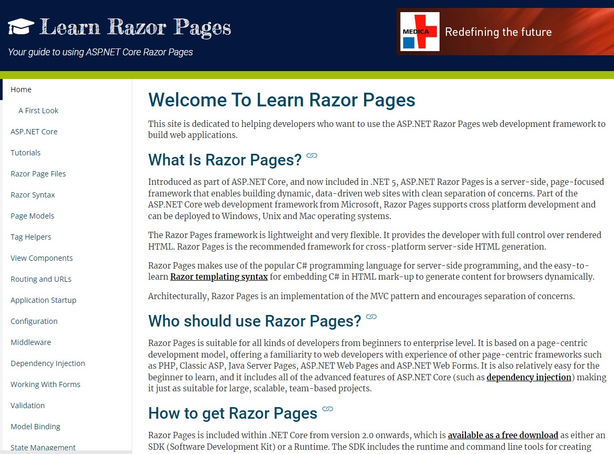
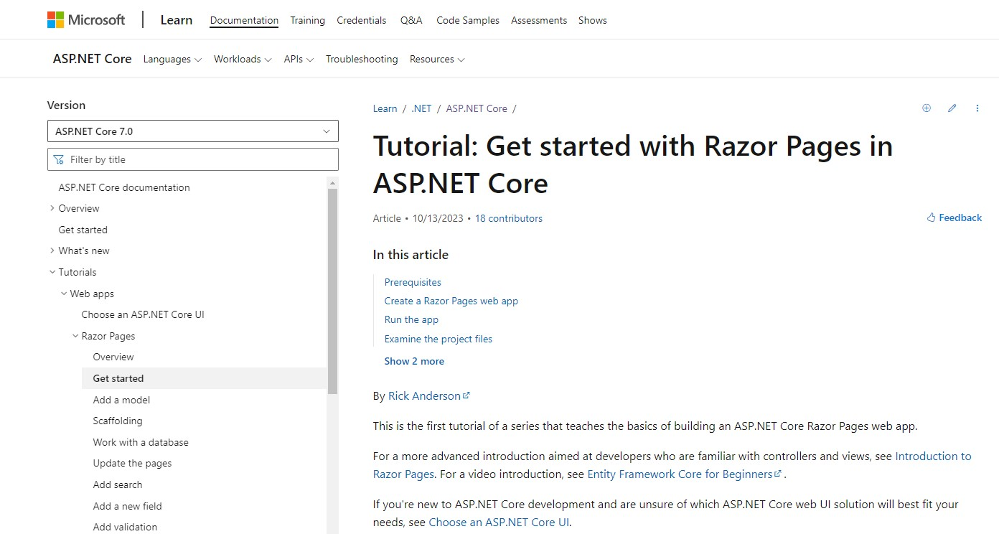
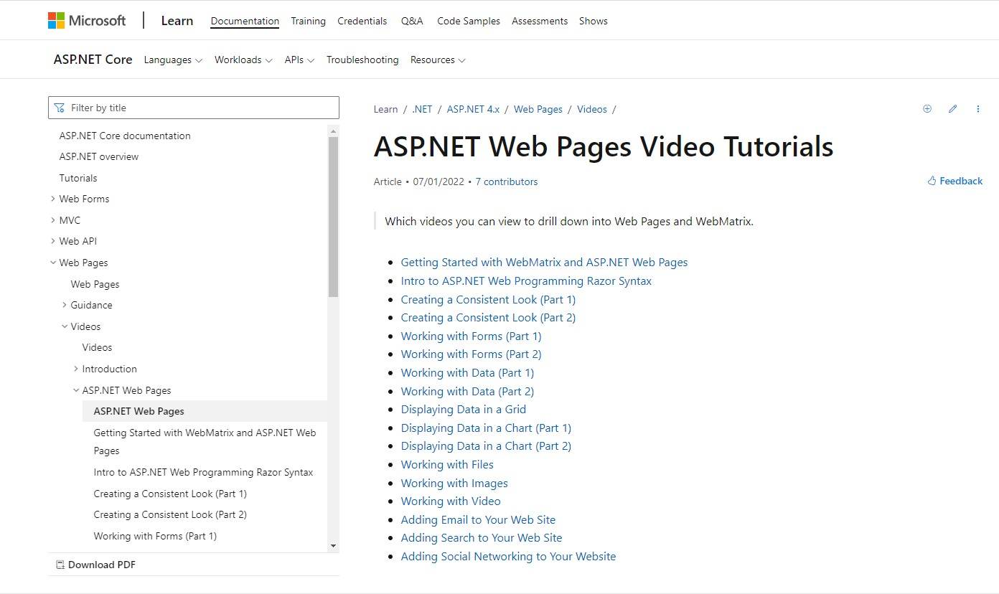
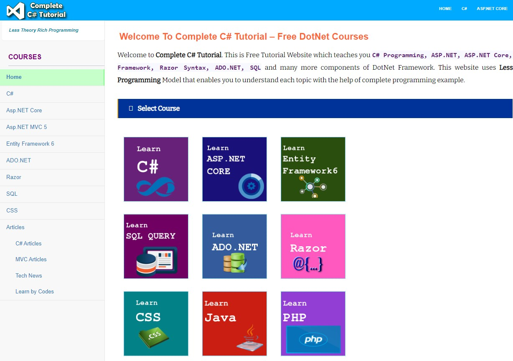
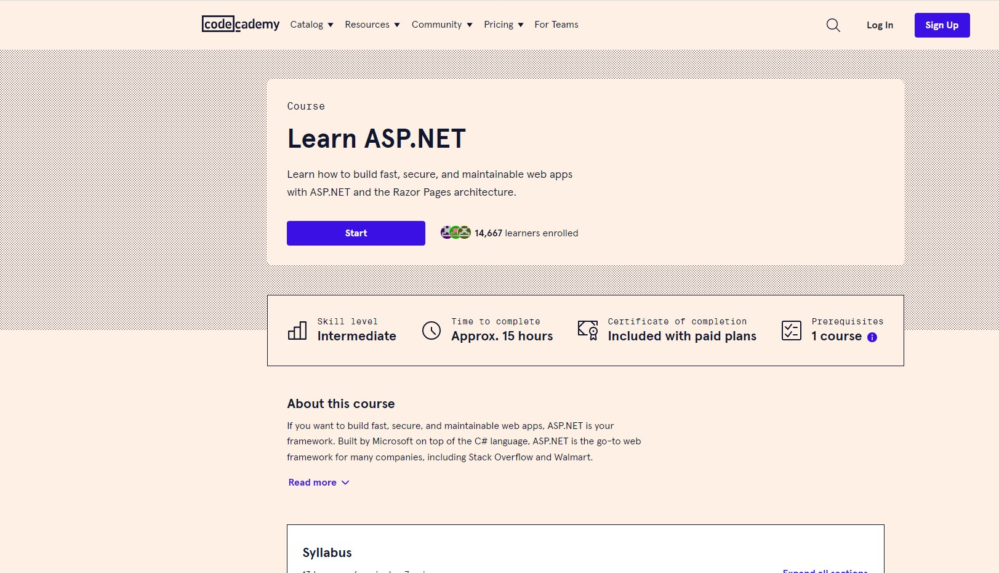
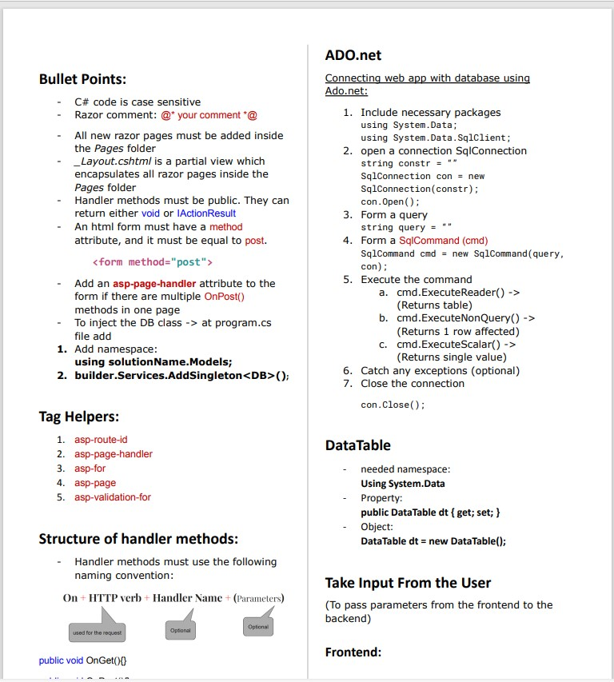
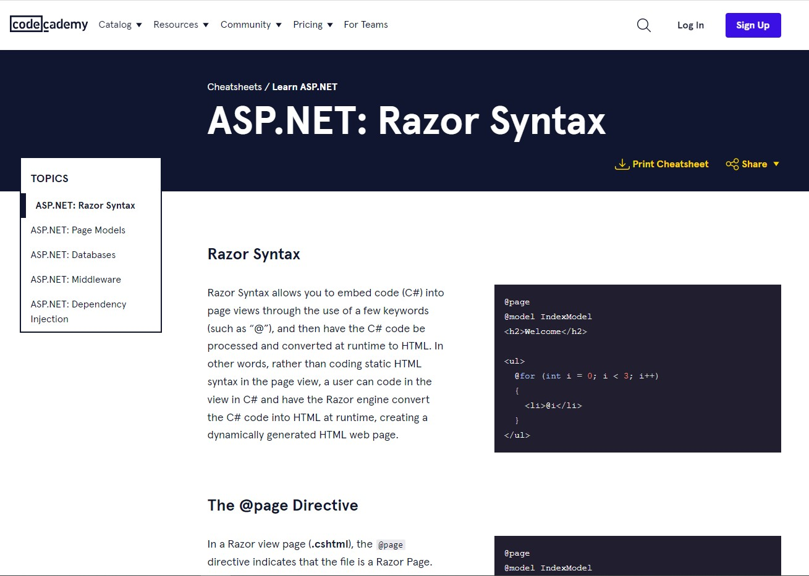
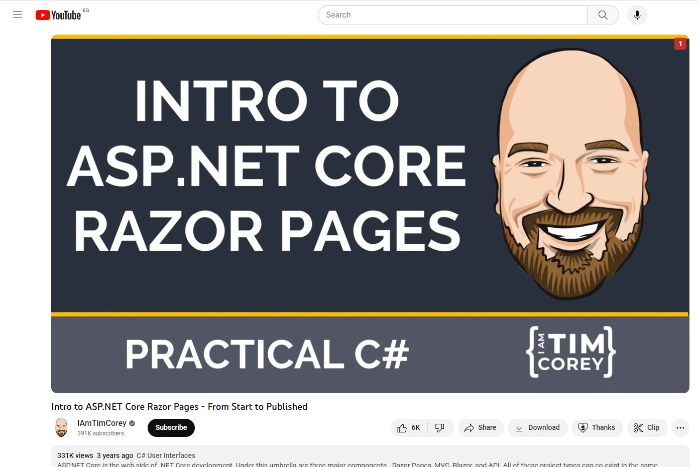

# Guide to Resources for CSAI202

A list of useful resources for learning razor pages, ordered by personal preference and organized into categories. Feel free to suggest more resources by creating a PR.

Content:
- [Full Resources](#full-resources)
- [Crash Courses and Cheatsheets](#cheatsheets-and-crash-courses)

## Full Resources
1. 📖 [LearnRazorPages.com](https://www.learnrazorpages.com/)
A very good documentation and explanation website for razor pages concepts and practices.

1. 📖 [Tutorial: Get started with Razor Pages in ASP.NET Core - from Microsoft](https://learn.microsoft.com/en-us/aspnet/core/tutorials/razor-pages/razor-pages-start?view=aspnetcore-7.0&tabs=visual-studio)

1. 📺 [Microsoft Video Tutorials](https://learn.microsoft.com/en-us/aspnet/web-pages/videos/aspnet-razor-pages/)

1. 📖 [Complete C# Tutorial Website](https://www.completecsharptutorial.com/)
    
    A Free Tutorial Website that teaches you C# Programming, ASP.NET, ASP.NET Core, MVC, Entity Framework, Razor Syntax, ADO.NET, SQL and many more components of DotNet Framework.

1. 📖 [Learn ASP.NET Razor Pages - on Codecademy](https://www.codecademy.com/learn/learn-asp-net)

1. 📺 [*CodeWithGopi*, ADO.NET Playlist, 12 videos](https://youtube.com/playlist?list=PLz3T2C4dYvQJBcQh2LEW6r84THgEmVzwq)

1. 📺 [*Questpond*, Session and ViewState in ASP.NET](https://www.youtube.com/watch?v=j7JqjDIU9BY)

## Cheatsheets and Crash Courses

1. [CIE206 SP23 CheatSheet](CIE206_SP23_LabExamCheatSheet.pdf)

2. [Codecademy Cheatsheet](https://www.codecademy.com/learn/learn-asp-net/modules/asp-net-razor-syntax/cheatsheet)

3. [Let's Learn .NET Razor Pages - by dotnet on Youtube](https://www.youtube.com/watch?v=5XWgEHcTe4k)

4. [Intro to Razor Pages - Tim Corey](https://www.youtube.com/watch?v=68towqYcQlY)

